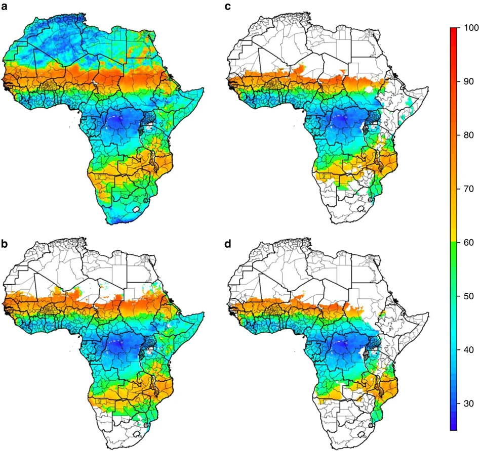
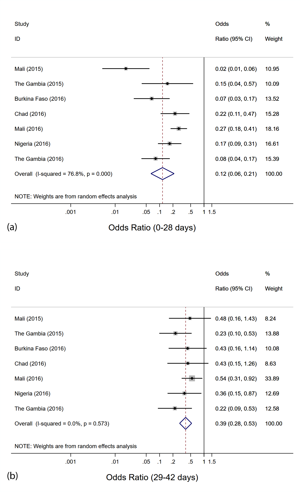
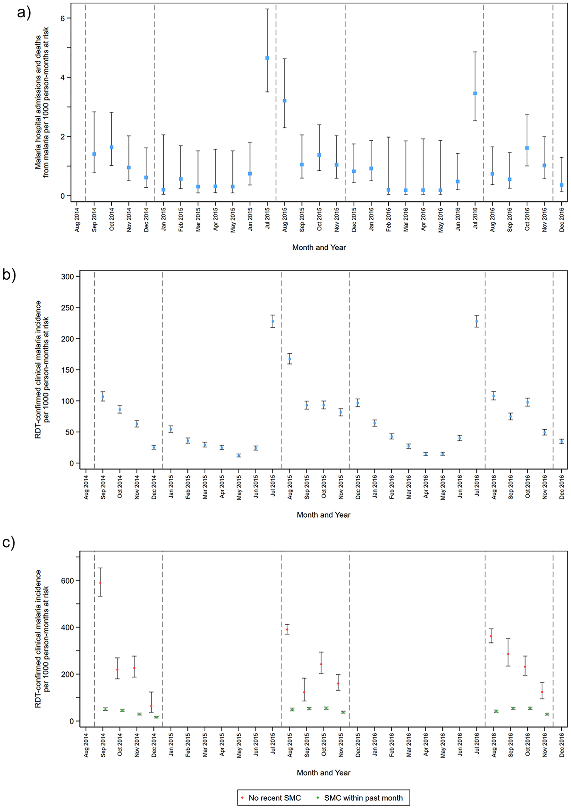
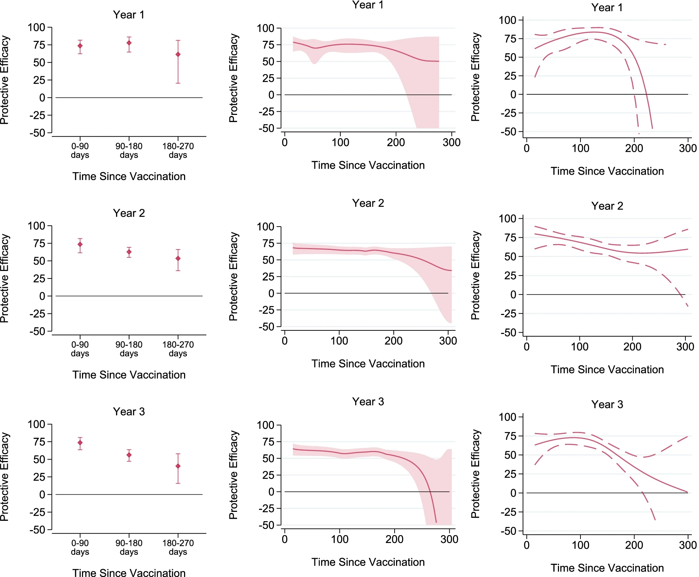
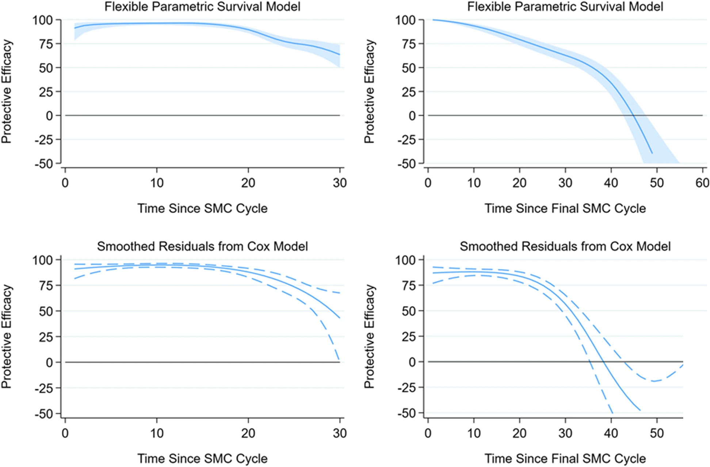

## About me

Epidemiologist / Statistician and Mathematical Modeller

Machine Learning and other Data Science Methods

## SMC mapping work that informed WHO Policy

## Case-control studies to determine efficacy of SMC at scale:

## Large cluster-randomised trial of SMC in Burkina Faso and Mali

## Groundbreaking trial of the RTS,S malaria vaccine in combination with SMC

[Paper here](https://www.nejm.org/doi/10.1056/NEJMoa2026330)

## Secondary analysis of vaccine trial data to estimate changing efficacy over time: 

SMC plot

